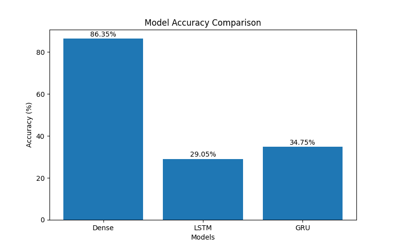
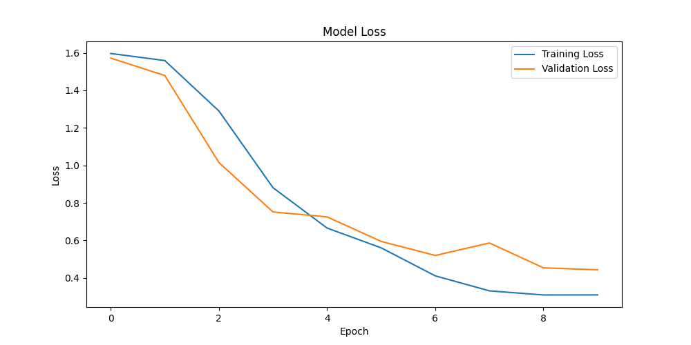

# Emotion Detection Using NLP and Deep Learning

## Project Overview

This project is an NLP-based Emotion Detection System that classifies text into six emotions:

* Anger
* Fear
* Joy
* Love
* Sadness
* Surprise

The system uses Deep Learning models including Dense Neural Network, LSTM, and GRU for multi-class emotion classification. A Streamlit web application is provided for real-time emotion prediction.

---

## Dataset

**Dataset:** Emotion Dataset for NLP

The dataset contains text samples labeled with six emotions.

### Dataset Split

| Dataset    | Samples |
| ---------- | ------: |
| Train      |  16,000 |
| Validation |   2,000 |
| Test       |   2,000 |

**Total Samples:** 20,000

---

## Technologies Used

* Python
* Pandas
* NumPy
* TensorFlow / Keras
* Scikit-Learn
* Matplotlib
* Streamlit
* Git & GitHub

---

## Project Structure

```text
Emotion_Detection_Project/
│
├── dataset/
│   ├── train.txt
│   ├── test.txt
│   └── val.txt
│
├── models/
│   ├── emotion_model.keras
│   ├── lstm_model.keras
│   └── gru_model.keras
│
├── graphs/
│   ├── Figure_1.png
│   ├── Figure_2.png
│   └── model_comparison.png
│
├── notebooks/
│   └── emotion_detection.ipynb
│
├── src/
│   ├── preprocessing.py
│   ├── train.py
│   ├── predict.py
│   ├── app.py
│   ├── lstm_model.py
│   ├── gru_model.py
│   ├── visualize.py
│   └── compare_models.py
│
├── requirements.txt
└── README.md
```

---

## Data Preprocessing

The following preprocessing steps were applied:

* Text cleaning
* Lowercasing
* Removing special characters
* Tokenization
* Sequence padding
* Label encoding

**Vocabulary Size:** 15,213 words

**Maximum Sequence Length:** 100

---

## Models Implemented

### 1. Dense Neural Network

* Embedding Layer
* GlobalAveragePooling1D
* Dense Layers
* Dropout
* Softmax Output Layer

### 2. LSTM Model

* Embedding Layer
* LSTM Layers
* Dense Layers
* Dropout

### 3. GRU Model

* Embedding Layer
* GRU Layers
* Dense Layers
* Dropout

---

## Model Performance

| Model                | Test Accuracy |
| -------------------- | ------------: |
| Dense Neural Network |    **86.35%** |
| LSTM                 |        29.05% |
| GRU                  |        34.75% |

### Best Model

Dense Neural Network achieved the highest accuracy and was selected for deployment.

### Model Comparison Graph



---

## Training Results

### Accuracy and Loss Curves




---

## Sample Predictions

| Input Text                           | Predicted Emotion |
| ------------------------------------ | ----------------- |
| I am very happy today                | Joy               |
| I am scared about tomorrow interview | Fear              |
| I feel lonely and depressed          | Sadness           |
| I am extremely excited               | Surprise          |

---

## Streamlit Web Application

Run the application:

```bash
streamlit run src/app.py
```

### Features

* Real-time emotion prediction
* Interactive user interface
* Deep Learning-powered classification
* Fast and lightweight deployment

---

## Installation

### Clone the Repository

```bash
git clone https://github.com/sahilsutar0110/Emotion-Detection-NLP-DeepLearning.git
```

### Navigate to the Project Folder

```bash
cd Emotion-Detection-NLP-DeepLearning
```

### Create Virtual Environment

```bash
python -m venv venv
```

### Activate Virtual Environment (Windows)

```bash
venv\Scripts\activate
```

### Install Dependencies

```bash
pip install -r requirements.txt
```

---

## Run Training

```bash
python src/train.py
```

---

## Run Prediction Script

```bash
python src/predict.py
```

---

## Future Improvements

* Transformer-based models (BERT)
* Hyperparameter tuning
* Cloud deployment
* REST API integration
* Advanced model comparison dashboard

---

## Results Summary

* Built an end-to-end NLP pipeline
* Implemented Dense, LSTM, and GRU architectures
* Achieved **86.35% Test Accuracy**
* Developed a Streamlit web application
* Compared multiple Deep Learning models
* Managed the project using Git and GitHub

---

## Author

**Sahil Sutar**

GitHub: https://github.com/sahilsutar0110

---

## License

This project is available under the MIT License.
