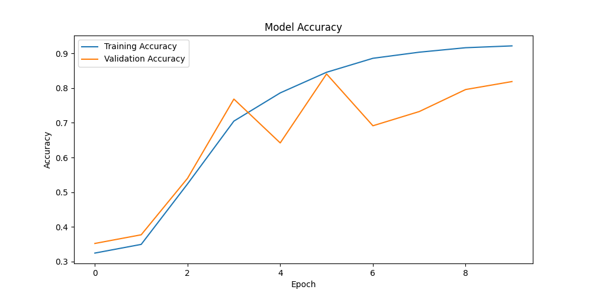

<<<<<<< HEAD
# Emotion Detection from Text using NLP & Deep Learning

## Project Overview

This project is an NLP-based Emotion Detection System that classifies user text into one of six emotions:

- Anger 😡
- Fear 😨
- Joy 😊
- Love ❤️
- Sadness 😢
- Surprise 😲

The model was trained using Deep Learning techniques and deployed through a Streamlit web application for real-time emotion prediction.

---

## Features

✅ Text Preprocessing

✅ Tokenization & Padding

✅ Emotion Classification

✅ Real-time Prediction

✅ Model Performance Visualization

✅ Streamlit Web Application

---

## Tech Stack

- Python
- TensorFlow / Keras
- NLP
- Pandas
- NumPy
- Scikit-Learn
- Matplotlib
- Streamlit

---

## Dataset

Dataset used:

Emotion Dataset from Kaggle

Classes:

| Label | Emotion |
|---------|---------|
| 0 | Anger |
| 1 | Fear |
| 2 | Joy |
| 3 | Love |
| 4 | Sadness |
| 5 | Surprise |

---

## Project Structure

```text
Emotion_Detection_Project/
│
├── dataset/
│   ├── train.txt
│   ├── test.txt
│   └── val.txt
│
├── models/
│   └── emotion_model.keras
│
├── graphs/
│   ├── accuracy.png
│   └── loss.png
│
├── src/
│   ├── preprocessing.py
│   ├── lstm_model.py
│   ├── train.py
│   ├── predict.py
│   ├── app.py
│   └── visualize.py
│
├── requirements.txt
└── README.md
```

---

## Data Preprocessing

The following preprocessing steps were performed:

- Convert text to lowercase
- Remove special characters
- Label Encoding
- Tokenization
- Sequence Padding

---

## Model Architecture

```text
Input Layer
     ↓
Embedding Layer
     ↓
GlobalAveragePooling1D
     ↓
Dense (128, ReLU)
     ↓
Dropout (0.3)
     ↓
Dense (64, ReLU)
     ↓
Dropout (0.3)
     ↓
Dense (6, Softmax)
```

---

## Model Performance

| Metric | Value |
|----------|----------|
| Training Accuracy | 90.51% |
| Validation Accuracy | 86.25% |
| Test Accuracy | 86.65% |

---

## Training Graphs


### Accuracy Curve



### Loss Curve


---

## Running the Project

### 1. Clone Repository

```bash
git clone https://github.com/sahilsutar0110/Emotion-Detection-NLP-DeepLearning.git
```

### 2. Create Virtual Environment

```bash
python -m venv venv
```

### 3. Activate Environment

Windows:

```bash
venv\Scripts\activate
```

### 4. Install Dependencies

```bash
pip install -r requirements.txt
```

---

## Train Model

```bash
python src/train.py
```

---

## Run Prediction Script

```bash
python src/predict.py
```

Example:

```text
Enter Text: I am very happy today

Predicted Emotion: joy
```

---

## Run Streamlit Application

```bash
streamlit run src/app.py
```

---

## Example Predictions

| Input Text | Predicted Emotion |
|------------|-------------------|
| I am very happy today | Joy |
| I miss my friend | Sadness |
| I am scared about tomorrow | Fear |
| I love spending time with my family | Love |
| I am angry with this situation | Anger |

---

## Future Improvements

- Bidirectional LSTM
- GRU Implementation
- BERT-based Emotion Classification
- Confidence Score Visualization
- Cloud Deployment
- Docker Containerization

---

## Author

Sahil Sutar

LinkedIn: www.linkedin.com/in/sahil-sutar-88381b318


GitHub: https://github.com/sahilsutar0110

Email: checkmate1sahil@gmail.com

---

## License

This project is for educational and portfolio purposes.
=======
# Emotion-Detection-NLP-DeepLearning
>>>>>>> 9439b99016331bd4cd777db0fa7af07819077d49
